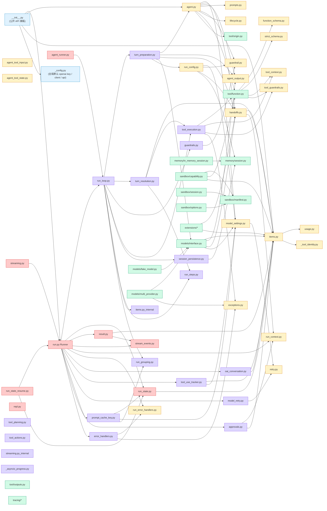
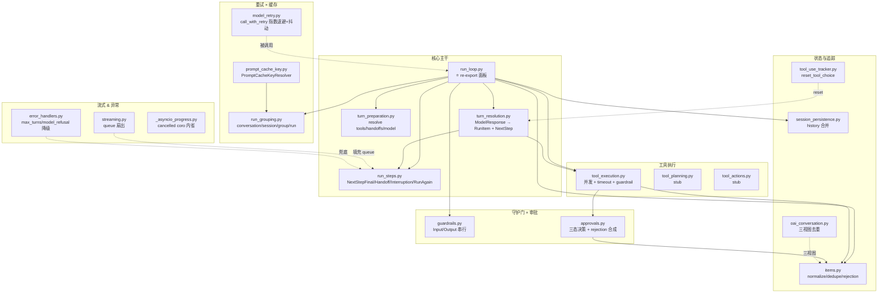
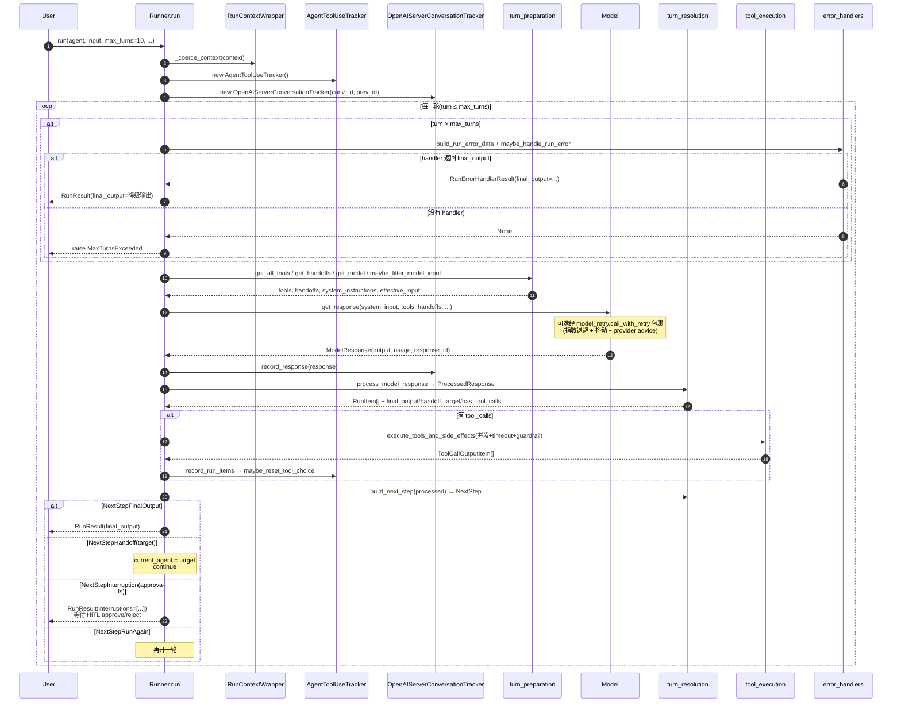
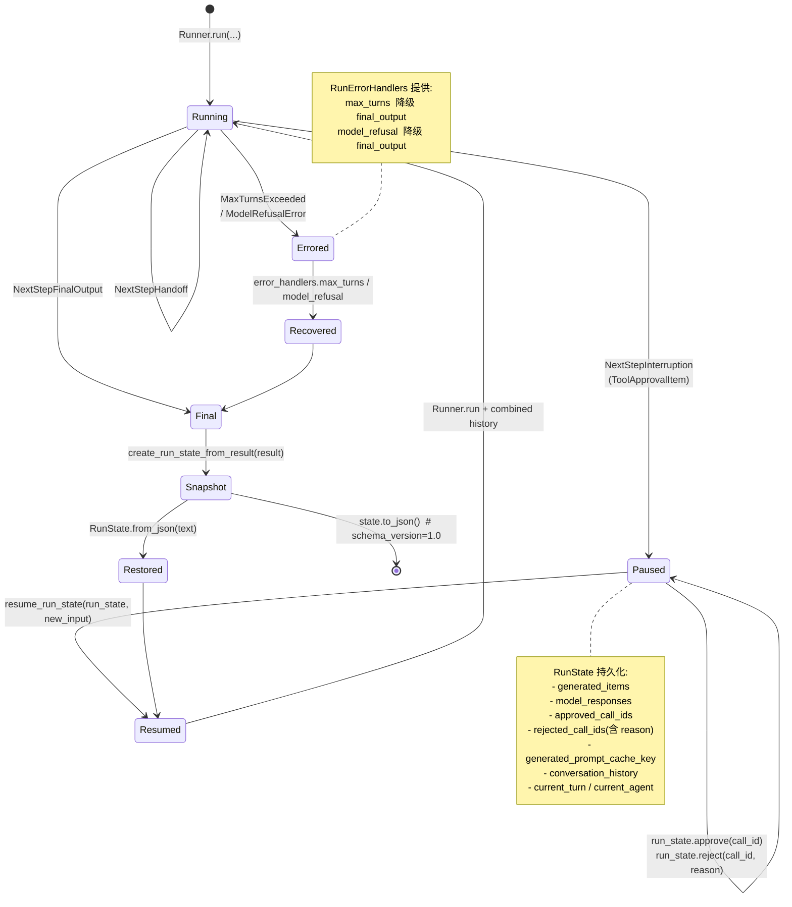
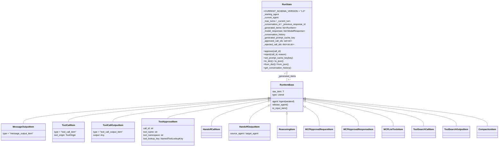
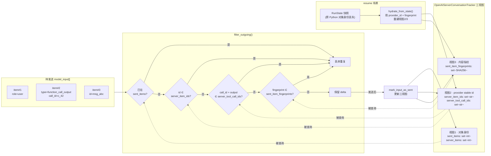
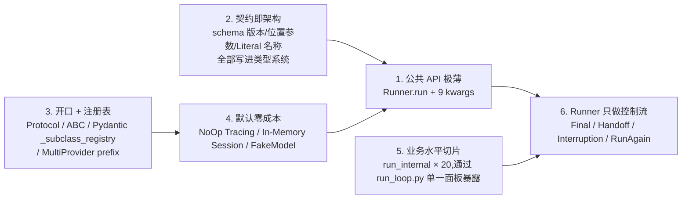

# microagent — 详细架构图设计

> 本文档以**架构图为主,文字为辅**,覆盖 10 张从宏观到微观的 Mermaid 图,按"分层 → 执行流 → 契约 → 扩展点"的顺序呈现 mini 版的完整架构。

---

## 图 1:同心圆分层(L0–L4)

按照 `AGENTS.md §1.1` 约定的 "Runner 仅编排,业务关进 `run_internal/`" 原则,整个框架分成 5 个同心圆。

```mermaid
graph TB
    subgraph L0["L0 · Public API Surface (__init__.py)"]
        L0A[Agent / Runner / AgentRunner]
        L0B[RunConfig / RunState / RunResult / RunResultStreaming]
        L0C[function_tool / handoff / Session / Tool]
        L0D[InputGuardrail / OutputGuardrail / ToolInput/OutputGuardrail]
        L0E[RunHooks / AgentHooks / RunContextWrapper]
        L0F[MultiProvider / FakeModel / Model]
        L0G[StreamEvent × 3 / tracing × 13 Span]
    end

    subgraph L1["L1 · Domain Abstractions"]
        L1A["agent.py<br/>(Agent / AgentBase / StopAtTools)"]
        L1B["items.py<br/>(13 RunItem + ItemHelpers + ModelResponse)"]
        L1C["handoffs.py<br/>(Handoff / HandoffInputData / nest_handoff_history)"]
        L1D["guardrail.py + tool_guardrails.py<br/>(4 位 Guardrail × 3 行为)"]
        L1E["lifecycle.py<br/>(RunHooks / AgentHooks)"]
        L1F["agent_output.py / agent_tool_input.py<br/>/ agent_tool_state.py / _tool_identity.py"]
        L1G["run_context.py / tool_context.py<br/>(RunContextWrapper + Approval ledger)"]
    end

    subgraph L2["L2 · Runner Orchestration"]
        L2A["run.py<br/>Runner.run / run_sync / run_streamed<br/>(≈290 行)"]
        L2B["agent_runner.py<br/>AgentRunner(实验性)"]
        L2C["streaming.py<br/>run_streamed 入口"]
        L2D["run_state_resume.py<br/>resume_run_state / create_run_state_from_result"]
    end

    subgraph L3["L3 · run_internal × 20 (切片)"]
        L3A["run_loop.py<br/>single_turn + re-export 面板"]
        L3B[turn_preparation + turn_resolution]
        L3C[tool_execution + tool_planning + tool_actions]
        L3D[guardrails + approvals]
        L3E[oai_conversation 三视图去重]
        L3F[model_retry + prompt_cache_key + run_grouping]
        L3G[tool_use_tracker + session_persistence]
        L3H["error_handlers + streaming<br/>+ _asyncio_progress + items + run_steps"]
    end

    subgraph L4["L4 · Plugins and Backends"]
        L4A["models/<br/>Model ABC + FakeModel + MultiProvider"]
        L4B["memory/<br/>Session Protocol + InMemorySession"]
        L4C["tool/<br/>FunctionTool + Tool Protocol"]
        L4D["sandbox/<br/>Manifest + Capability + BaseSandboxSession"]
        L4E["tracing/<br/>NoOp 默认 + 13 Span"]
        L4F["extensions/<br/>handoff_filters + handoff_prompt + visualization"]
    end

    subgraph ADDON["Addons (进程外扩展)"]
        AD1[addons/openai OpenAI ChatCompletions]
        AD2[addons/session_sqlite]
        AD3[addons/tracing_otel]
    end

    L0 --> L1
    L1 --> L2
    L2 --> L3
    L3 --> L4
    L4 -.可选装.-> ADDON
```



**不变量**:
- L2 **只持有 ≈290 行**,绝不跨 L3 直接写业务
- L3 的 20 个切片对 L2 暴露 `run_loop.py` 单一 import 面板
- L4 全部默认行为都是 **NoOp / In-Memory / FakeModel**,重资产上云靠 addon

---

## 图 2:完整模块拓扑(40+ 文件全景)



---

## 图 3:`run_internal/` 切片关系(20 个文件的依赖网)



**关键依赖规则**:
- **禁止反向依赖**:L3 不能 import L2(`run.py`)
- **禁止横穿 `run_internal/` 以外**:切片之间只能通过 `run_loop.py` re-export 面板暴露
- 所有 L3 文件都 `from ..xxx import` domain/contract,**绝不**直接 `from ..run import`

---

## 图 4:`Runner.run` 单轮执行流(时序)



---

## 图 5:`RunState` 生命周期 × HITL pause/resume



---

## 图 6:RunItem 家族 × RunState Schema



---

## 图 7:服务端会话三视图去重(`OpenAIServerConversationTracker`)



**为什么三视图**:
- 只有 id 不够:Python 对象重建时 `id()` 变化 → 靠 provider_id 兜底
- provider_id 不一定有:`FakeModel` 用占位 ID → 靠 fingerprint 兜底
- fingerprint 也不绝对:`tool_search` 返回匿名项 → 三者联合才能稳定去重

---

## 图 8:Tool 执行流水线

```mermaid
graph TB
    START["turn_resolution<br/>识别到 function_call"]
    BUILD[建立 ToolCallItem]
    CHECK{needs_approval?}
    APPR_REQ[生成 ToolApprovalItem<br/>NextStepInterruption]

    subgraph EXEC["execute_function_tool_calls"]
        SEM[asyncio.Semaphore<br/>max_concurrency=10]
        LOOP[对每个 ToolCallItem]
        INPG[ToolInputGuardrail 串行]
        GATE1{guardrail behavior}
        BUILD_CTX[ToolContext.from_run_context<br/>tool_name / call_id / tool_arguments]
        INVOKE[await tool.on_invoke_tool<br/>asyncio.wait_for(timeout)]
        OUTPG[ToolOutputGuardrail 串行]
        GATE2{output guardrail behavior}
        OK_OUT[ToolCallOutputItem]
        REJ_OUT[合成 reject_content 输出]
        TO_ERR{timeout?}
        TO_HANDLE[timeout_error_function 或<br/>ToolTimeoutError]
    end

    APPROVED[HITL approve 后]
    REJECTED[HITL reject 后]
    REJ_ITEM[function_rejection_item<br/>call_id + message]

    START --> BUILD --> CHECK
    CHECK -->|是| APPR_REQ
    APPR_REQ --> APPROVED
    APPR_REQ --> REJECTED
    REJECTED --> REJ_ITEM
    APPROVED --> SEM
    CHECK -->|否| SEM

    SEM --> LOOP --> INPG --> GATE1
    GATE1 -->|allow| BUILD_CTX
    GATE1 -->|reject_content| REJ_OUT
    GATE1 -->|raise_exception| STOP[ToolInputGuardrailTripwireTriggered]
    BUILD_CTX --> INVOKE
    INVOKE --> TO_ERR
    TO_ERR -->|是| TO_HANDLE
    TO_ERR -->|否| OUTPG
    OUTPG --> GATE2
    GATE2 -->|allow| OK_OUT
    GATE2 -->|reject_content| REJ_OUT
    GATE2 -->|raise_exception| STOP2[ToolOutputGuardrailTripwireTriggered]

    OK_OUT --> DONE[回到 turn_resolution]
    REJ_OUT --> DONE
    REJ_ITEM --> DONE
    TO_HANDLE --> DONE
```

---

## 图 9:Guardrails 四位 × 三行为 × HITL Approvals 一体化

```mermaid
graph LR
    subgraph PRE["turn 前 / 模型前"]
        IG["InputGuardrail<br/>(仅首轮 + 起始 Agent)"]
    end
    subgraph MID["工具边界"]
        TIG["ToolInputGuardrail<br/>(工具执行前)"]
        TOG["ToolOutputGuardrail<br/>(工具执行后)"]
    end
    subgraph POST["final output 前"]
        OG["OutputGuardrail<br/>(agent 输出 final 时)"]
    end

    subgraph BEHAVIOR["3 行为"]
        B1[Allow<br/>继续执行]
        B2[RejectContent<br/>合成 tool output 返给模型]
        B3[RaiseException<br/>中止 run + 专属 Tripwire 异常]
    end

    subgraph HITL["HITL Approvals"]
        H1[ToolApprovalItem<br/>暂停到 RunState]
        H2[RunContextWrapper._approvals<br/>ledger 按 tool_name+call_id]
        H3["approve_tool(always_approve)<br/>reject_tool(message, always_reject)"]
        H4[get_approval_decision<br/>→ approved/pending/rejected+msg]
        H5[sticky_rejection_message<br/>/ rejection_messages per call_id]
    end

    IG --> B1 & B2 & B3
    OG --> B1 & B2 & B3
    TIG --> B1 & B2 & B3
    TOG --> B1 & B2 & B3

    TIG -.tool.needs_approval.-> H1
    H1 --> H2
    H2 --> H3
    H3 --> H4
    H4 --> H5
    H4 -.approved.-> B1
    H4 -.rejected.-> B2
```

---

## 图 10:扩展性矩阵(8 条开口)

```mermaid
graph TB
    subgraph CORE["microagent core(≈9K 行)"]
        direction TB
        PM[Model ABC]
        PS[Session Protocol]
        PT[Tool Protocol]
        PG[Guardrail Callable]
        PH[TracingProcessor Protocol]
        PSB[BaseSandboxSession / Capability]
        PMCP[MCPServer 字段占位]
        PCFG[set_default_openai_* 全局配置]
    end

    subgraph ADDONS["Addons"]
        AO[addons/openai<br/>OpenAIChatCompletionsModel + Provider]
        AS[addons/session_sqlite<br/>SQLiteSession]
        AT[addons/tracing_otel<br/>OTel BatchExporter]
    end

    subgraph FUTURE["未来 Addon 生态"]
        F1[microagent-anthropic]
        F2[microagent-mcp<br/>stdio/SSE/HTTP transport]
        F3[microagent-sandbox-docker]
        F4[microagent-sandbox-e2b]
        F5[microagent-session-redis]
        F6[microagent-realtime]
        F7[microagent-voice]
    end

    subgraph REG["注册机制"]
        R1[MultiProvider.register prefix → provider]
        R2[CapabilityRegistry.register type → class]
        R3[BaseSandboxClientOptions._subclass_registry<br/>Pydantic type 字段自动多态]
        R4[add_trace_processor]
        R5[Agent.mcp_servers = [...]]
    end

    PM --> AO
    PS --> AS
    PH --> AT
    PM -.-> F1
    PMCP -.-> F2
    PSB -.-> F3 & F4
    PS -.-> F5
    PM -.-> F6
    PM -.-> F7

    AO --> R1
    AT --> R4
    F2 --> R5
    F3 --> R2 & R3
    F4 --> R2 & R3
    F5 --> PS
```

---

## 11. 关键不变量总表(AGENTS.md 落地)

| § | 不变量 | 责任文件 | 违反后果 |
|---|---|---|---|
| 1.1 | Runner 仅编排 | `run.py` ≤ 300 行 | PR 评审 reject |
| 1.2 | Stream ↔ Non-Stream 对齐 | `run_loop.py` 共享 `run_single_turn` | stream 测试失败 |
| 1.3 | `CURRENT_SCHEMA_VERSION` + `SCHEMA_VERSION_SUMMARIES` | `run_state.py` import 期断言 | import 直接 AssertionError |
| 1.4 | 公共 API 位置参数顺序 | `RunConfig / FunctionTool / Agent / AgentHookContext` | 位置回归测试失败 |
| 1.5 | 新 Item 类型 ⇒ 8 处同步 | `items.py` + `run_internal/items.py` + `run_steps.py` + `turn_resolution.py` + `tool_execution.py` + `stream_events.py` + `run_state.py` + `session_persistence.py` | 运行时类型错配 |
| 1.6 | StreamEvent 名称冻结 | `stream_events.py` Literal | 破坏外部消费者合约 |

---

## 12. 一页式执行心法



> **"Runner 只做编排,复杂度关进 `run_internal/`;一切对外即契约,一切对内即注册表。"**
>
> 这一句话在 mini 版里由 5 个同心圆 × 20 个切片 × 8 条扩展开口 × 6 条强制不变量共同兑现 — 以 ~9K LoC 的核心体量,承载了与 openai-agents-python 同构的工业级骨架。