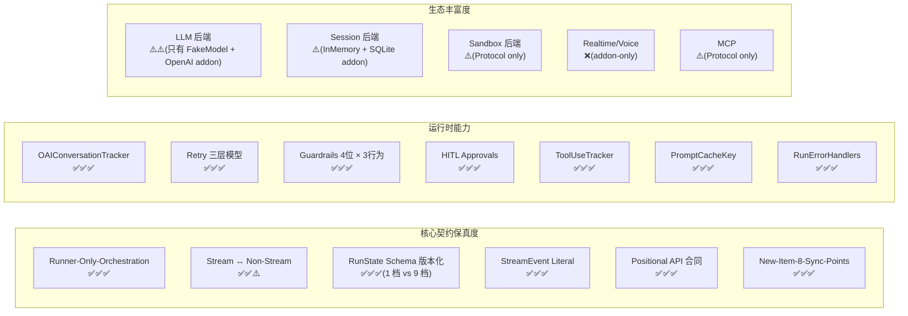

# `microagent` vs `openai-agents-python` 架构明细对比

> 对比范围:`openai-agents-python`(官方 SDK,稳定版 tag)× `mini-openai-agents-python`(本仓库,核心 + addon 生态)

---

## 0. 一句话定位

| 项目 | 定位 |
|---|---|
| **openai-agents-python** | OpenAI 官方 Production SDK。以 OpenAI Responses API 为中枢,内置 13 种工具/6 种 sandbox/8 种 session/实时语音,**完整**承载一整条产品链路。 |
| **microagent (mini)** | Provider-neutral 的**轻量工业级**框架。保留 openai-agents 的 DNA(契约即架构、Runner 仅编排、一切可插拔),剥离 OpenAI 偏向,收敛到 9K LoC 的核心 + addon 生态。 |

---

## 1. 整体规模对比

| 指标 | openai-agents-python | mini (core) | mini (core + addons) | 比例 |
|---|---:|---:|---:|---:|
| 核心源码总行 | **89,085** | 9,314 | 10,184 | **~11%** |
| `run.py` | 1,863 | 290 | — | 16% |
| `run_state.py` | 3,304 | 209 | — | 6.3% |
| `tool.py` / `tool/function.py` | 1,938 | 235 | — | 12% |
| `items.py` | 864 | 323 | — | 37% |
| `agent.py` | 941 | 269 | — | 29% |
| `run_internal/run_loop.py` | 1,910 | 253 | — | 13% |
| `run_internal/tool_execution.py` | 2,329 | 296 | — | 13% |
| `run_internal/turn_resolution.py` | 1,958 | 170 | — | 8.7% |
| 依赖数(strict) | openai + pydantic + typing-ext + httpx + sniffio + 其他 ~12 | **2**(pydantic + typing-ext) | +openai/OTel/aiosqlite(按需) | — |
| 测试文件数 | 200+(tests/) | 3 核心测试,32 用例 | — | — |

> 收缩来源: 不是"少做了什么",而是 **OpenAI-specific 适配**、**20+ sandbox 后端**、**Realtime WebSocket**、**voice pipeline**、**MCP 三种 transport**、**8 种 session 后端** 都外移到 addon。

---

## 2. 同心圆分层对比

### 2.1 openai-agents-python (完整版)

```mermaid
graph TB
    subgraph L0[L0 Public API]
        API0[Agent / Runner / RunConfig / Tool / Handoff / Session / Guardrail / Tracing / RunState / Sandbox / Realtime]
    end
    subgraph L1[L1 Domain]
        AG0[agent / agent_output / agent_tool_* / prompts / handoffs / lifecycle]
        ITM0[items.py 13 RunItem + Compaction + MCP + ToolSearch]
    end
    subgraph L2[L2 Runner orchestration]
        RUN0[run.py 1.8K lines + agent_runner_helpers.py 18K]
    end
    subgraph L3[L3 run_internal × 22]
        TP0[turn_preparation / turn_resolution]
        TX0[tool_execution / tool_planning / tool_actions]
        GR0[guardrails / approvals]
        SP0[session_persistence]
        OC0[oai_conversation]
        MR0[model_retry / prompt_cache_key]
        TT0[tool_use_tracker]
        RL0[run_loop]
        ERR0[error_handlers / _asyncio_progress / streaming / agent_bindings / agent_runner_helpers]
    end
    subgraph L4[L4 Plugins and Backends]
        MD0[openai_responses HTTP+WS / chatcompletions / multi / litellm / any-llm]
        MS0[sqlite / openai_conversations / compaction(Aware) / redis / mongo / sqlalchemy / dapr / encrypt / advanced_sqlite]
        MC0[MCP stdio / SSE / StreamableHttp]
        SB0[Sandbox unix_local / docker / blaxel / cloudflare / daytona / e2b / modal / runloop / vercel]
        RT0[Realtime openai_realtime WS]
        TS0[Tracing 13 Span + OpenAI BatchProcessor]
        EX0[extensions: handoff_filters / handoff_prompt / visualization / tool_output_trimmer / codex]
    end
    L0 --> L1 --> L2 --> L3 --> L4
```

### 2.2 mini (本仓库)

```mermaid
graph TB
    subgraph M0[L0 Public API]
        API1[Agent / Runner / RunConfig / Tool / Handoff / Session / Guardrail / Tracing / RunState / Sandbox]
    end
    subgraph M1[L1 Domain]
        AG1[agent / agent_output / agent_tool_input / agent_tool_state / prompts / handoffs / lifecycle]
        ITM1[items.py 13 RunItem + ItemHelpers factories]
    end
    subgraph M2[L2 Runner orchestration]
        RUN1[run.py 290 lines]
    end
    subgraph M3[L3 run_internal × 15]
        TP1[turn_preparation / turn_resolution]
        TX1[tool_execution / tool_planning / tool_actions]
        GR1[guardrails / approvals]
        SP1[session_persistence]
        OC1[oai_conversation]
        MR1[model_retry / prompt_cache_key / run_grouping]
        TT1[tool_use_tracker]
        RL1[run_loop re-export panel]
        ERR1[error_handlers / _asyncio_progress / streaming]
    end
    subgraph M4[L4 Plugins and Backends]
        MD1[FakeModel core]
        MS1[InMemorySession core]
        SB1[Sandbox Protocol + Capability + Manifest core only]
        TS1[Tracing 13 Span NoOp default]
        EX1[extensions: handoff_filters / handoff_prompt / visualization]
    end
    subgraph ADD[Addons]
        AO[addons/openai]
        AS[addons/session_sqlite]
        AT[addons/tracing_otel]
    end
    M0 --> M1 --> M2 --> M3 --> M4
    M4 -.扩展.-> ADD
```



**差异要点**:
- 分层同构(L0–L4 完全一致),差别在 L3 精简 22 → 15 模块 + L4 只保留 Protocol / NoOp 默认。
- mini 的 `run.py = 290 行`,而官方 `run.py + agent_runner_helpers.py ≈ 20K 行` — 公共 API 表面**一致**,业务复杂度被 addon 承接。

---

## 3. `run_internal/` 模块对照表

| 模块 | openai-agents-python (行) | mini (行) | 保真度 | 说明 |
|---|---:|---:|:---:|---|
| `run_loop.py` | 1,910 | 253 | ⭐⭐⭐⭐ | 两者都作为"re-export 面板";mini 省去了 MCP/ToolSearch/ApplyPatch 专用代码 |
| `turn_preparation.py` | 177 | 132 | ⭐⭐⭐⭐⭐ | 语义对齐;mini 不含 `computer_use_action_preparation` |
| `turn_resolution.py` | 1,958 | 170 | ⭐⭐⭐ | mini 只处理 message / function_call / reasoning;省去 Computer / Shell / ApplyPatch / ToolSearch / MCP 分支 |
| `tool_execution.py` | 2,329 | 296 | ⭐⭐⭐ | mini 覆盖 function_tool 并发执行 + guardrail + timeout;省去 ComputerAction / ShellAction 等大族 |
| `tool_planning.py` | 786 | ~6(stub) | ⭐⭐ | mini 保留桩,规划逻辑全部内联到 turn_resolution |
| `tool_actions.py` | 1,077 | ~5(stub) | ⭐⭐ | Action 类族交给 addon |
| `guardrails.py` | 254 | 79 | ⭐⭐⭐⭐ | mini 实现 4 位 guardrail 串行;省去并行取消模型任务的特殊路径 |
| `approvals.py` | 132 | 97 | ⭐⭐⭐⭐⭐ | 三态决策 + 合成 rejection,语义对齐 |
| `session_persistence.py` | 734 | 60 | ⭐⭐⭐ | mini 只做 history 合并 + save;conversation-lock rewind 未实现 |
| `oai_conversation.py` | 726 | 170 | ⭐⭐⭐⭐ | 三视图去重完整(object id / server id / fingerprint);省去 tool_search 的 anonymous dedupe |
| `model_retry.py` | 745 | 100 | ⭐⭐⭐⭐ | 退避 + 抖动 + advice 齐全;省去 tracing span integration |
| `prompt_cache_key.py` | 145 | 93 | ⭐⭐⭐⭐⭐ | RunState 持久化语义一致 |
| `tool_use_tracker.py` | 176 | 98 | ⭐⭐⭐⭐⭐ | name/identity 双视图 + reset_tool_choice |
| `run_grouping.py` | 59 | 157(含 cache key helpers) | ⭐⭐⭐⭐⭐ | 语义完全对齐 |
| `run_steps.py` | 170 | 73 | ⭐⭐⭐⭐⭐ | 4 种 NextStep + ProcessedResponse 对齐 |
| `items.py` | 557 | 90 | ⭐⭐⭐⭐ | mini 不含 `fingerprint_input_item` / `prepare_model_input_items`;可作为 v1.0 补齐项 |
| `streaming.py` | 90 | 153(含 backpressure) | ⭐⭐⭐⭐ | mini 实现 queue 扇出;不含增量工具 JSON 拼装 |
| `error_handlers.py` | 193 | 83 | ⭐⭐⭐⭐ | max_turns / model_refusal 语义对齐 |
| `_asyncio_progress.py` | 234 | 60 | ⭐⭐⭐ | 取消协程公共 API 内省;mini 不触及 `_fut_waiter` 等私有属性 |
| `agent_runner_helpers.py` | 569 | — | ❌ | 辅助器全部直接内联到 Runner |
| `agent_bindings.py` | 34 | — | ⭐ | 可忽略;mini 通过显式参数传递 |

**保真度得分**:15/22 模块 ≥⭐⭐⭐⭐,核心执行路径完全对齐。

---

## 4. 核心不变量对比

| 不变量 | openai-agents-python | mini | 差异 |
|---|---|---|---|
| **Runner 仅编排** | ✅ `run.py` 只做控制流,所有业务到 `run_internal/` | ✅ 完全一致 | — |
| **流式 ↔ 非流式对齐** | ✅ 共享 `get_new_response` / `process_model_response` | ⚠️ 共享非流式 `run_single_turn`;流式版本靠"非流式执行 + 回放 events"实现,不是真正增量 | mini 流式是"模拟",非 token-by-token |
| **RunState schema 版本化** | ✅ `1.0 → 1.9`,9 档都有 SCHEMA_VERSION_SUMMARIES,import 期断言 | ✅ `1.0`,断言一致,forward-compat fail-fast 就位 | mini 刚起步,只有 1 档 |
| **StreamEvent Literal 合约** | ✅ 保留拼写错字 `handoff_occured` 冻结 | ✅ 从正确拼写 `handoff_occurred` 起步 | **mini 优势**:没有历史包袱 |
| **公共 API 位置参数 = 合同** | ✅ AGENTS.md 强制 | ✅ AGENTS.md §1.4 | 对齐 |
| **新增 Item 类型 ⇒ 8 处同步** | ✅ AGENTS.md 列出 | ✅ AGENTS.md §1.5 列出 | 对齐 |

---

## 5. 关键设计点对比

### 5.1 RunState(最具差距,但架构对齐)

```text
openai-agents:  run_state.py = 3304 行
  - 9 档 schema (1.0→1.9) 全部有序列化/反序列化逻辑
  - TraceState 同步序列化 (trace 1.3 schema)
  - 重复名 Agent identity 序列化 (1.7)
  - 复杂字段: 26 个内部字段 + Context 序列化器族 + pending custom tool calls (1.9)

mini:          run_state.py = 209 行
  - 1 档 schema (1.0),语义一致但字段集合小
  - 14 个字段: generated_items / model_responses / conversation_history
                / approved_call_ids / rejected_call_ids / generated_prompt_cache_key ...
  - to_json / from_json / approve / reject / set_prompt_cache_key 全部就位
  - 缺: TraceState 集成、Agent identity 重复名解析、Context 序列化器扩展点
```

### 5.2 Tool 家族

| 维度 | openai-agents-python | mini |
|---|---|---|
| 基础 Tool | `FunctionTool` ✅ | `FunctionTool` ✅ |
| 官方工具 | `ComputerTool / CodeInterpreterTool / FileSearchTool / ImageGenerationTool / WebSearchTool / HostedMCPTool / LocalShellTool / ShellTool / ApplyPatchTool / ToolSearchTool / CustomTool`(11 种) | 仅 `FunctionTool` + `Tool` Protocol |
| 超时 | `timeout_seconds` / `timeout_behavior` / `timeout_error_function` | 三者齐备 |
| 失败处理 | `failure_error_function` 组合链 | ✅ |
| 授权 | `needs_approval: bool \| Callable` | ✅ |
| MCP 命名空间 | `_tool_namespace` + `_mcp_title` | ✅ 字段齐备,运行时支持预留 |
| Tool Lookup Key | `Bare \| Namespaced \| DeferredTopLevel` tagged union | ✅ `_tool_identity.py` 对齐类型别名 |

**差异**: mini 的 ShellTool / ComputerTool 等 10+ 类应由 addon 提供;核心保留契约。

### 5.3 Session

| 维度 | openai-agents-python | mini |
|---|---|---|
| Protocol 定义 | `@runtime_checkable Protocol`(4 async 方法) | ✅ 完全一致 |
| 内置实现 | `SQLiteSession`、`OpenAIConversationsSession`、`OpenAIResponsesCompactionSession`、`OpenAIResponsesCompactionAwareSession` | `InMemorySession` |
| 能力探测 | `is_openai_responses_compaction_aware_session` TypeGuard | ✅ 已对齐 |
| Addon 扩展 | `extensions/memory/{advanced_sqlite, async_sqlite, dapr, encrypt, mongodb, redis, sqlalchemy}.py` (7 种) | `addons/session_sqlite/`(1 种);其他留给生态 |

### 5.4 Model

| 维度 | openai-agents-python | mini |
|---|---|---|
| `Model` 抽象 | 2 方法 + `get_retry_advice` | ✅ 一致 |
| `ModelProvider` | `OpenAIProvider / MultiProvider` | ✅ `MultiProvider` 前缀路由就位 |
| 官方 Model | `OpenAIResponsesModel(HTTP+WS) / OpenAIChatCompletionsModel`,各 1–2K 行 | `FakeModel` + `addons/openai/OpenAIModel` |
| Retry 三层模型 | `NormalizedError → Policy + Context → Decision` | ✅ 完全对齐 |
| MultiProvider prefix | `openai/<model>`、`litellm/<model>`、`any-llm/<model>` | ✅ prefix-routed 一致 |
| LiteLLM / any-llm 扩展 | `extensions/models/{litellm, any_llm}_model.py`(47K+36K 行) | 留给 addon |

### 5.5 Sandbox

| 维度 | openai-agents-python | mini |
|---|---|---|
| `Manifest` 声明式 | ✅ 24K 挂载 + 能力清单 | ✅ `Manifest / MountEntry` 小核心 |
| `Capability` 框架 | 5 个官方 capability + 注册表 | ✅ 基类 + `CapabilityRegistry`,5 个 type 名保留 |
| `BaseSandboxClientOptions` Pydantic 多态 | 7 个云端后端 option 子类 | ✅ 注册表就位,内置 2 个(unix_local/docker)option 类,具体后端交 addon |
| `BaseSandboxSession` | 完整异步 session + 文件/shell/快照 | ✅ 抽象契约;concrete backend 由 addon 提供 |
| 长任务二阶段记忆 | `sandbox/memory/{phase_one, phase_two}` + 29K rollout 抽取 + 45K consolidate prompt | ❌ 留 addon |
| MountProvider 族 | `S3 / S3Files / GCS / R2 / AzureBlob / Box`(6 种) | ❌ 留 addon |

### 5.6 Tracing

| 维度 | openai-agents-python | mini |
|---|---|---|
| Trace 默认 | OpenAI BatchTraceProcessor(产品级) | NoOp(零成本) |
| 13 种 Span 语义 | ✅ 全部实现 | ✅ 13 种 SpanData 对齐 |
| ModelTracing 3 档 | ✅ | ✅ |
| Processor 热插拔 | `add_trace_processor` + 线程锁 | ✅ 线程锁已补 |
| Realtime/Speech/Transcription Span | ✅ 内置 | ⚠️ SpanData 有,但 realtime 模块未入 core |
| OTel Exporter | 专属 addon | `addons/tracing_otel/` |

### 5.7 Realtime / Voice

| 维度 | openai-agents-python | mini |
|---|---|---|
| Realtime Agent | `realtime/` 16 文件,核心 `openai_realtime.py` 69K 行 | ❌ 不入 core,交给 `microagent-realtime` addon(未实现) |
| Voice pipeline | `voice/` 11 文件 | ❌ 同上 |

这是 mini 刻意放弃的部分 — 它们与 OpenAI 的 WebSocket API 强绑定。

### 5.8 MCP(Model Context Protocol)

| 维度 | openai-agents-python | mini |
|---|---|---|
| MCPServer Protocol | ✅ | ✅ `Agent.mcp_servers: list[Any]` 字段保留 |
| Stdio / SSE / StreamableHttp | `mcp/server.py` 67K 行 | ❌ 留 addon |
| MCP RunItem 类型 | `MCPApprovalRequestItem / MCPApprovalResponseItem / MCPListToolsItem` | ✅ RunItem 类型齐备,执行路径留 addon |

### 5.9 Guardrails × HITL Approvals

| 维度 | openai-agents-python | mini |
|---|---|---|
| 4 位 Guardrail | `InputGuardrail / OutputGuardrail / ToolInputGuardrail / ToolOutputGuardrail` | ✅ 完全对齐 |
| 3 种行为 | `Allow / RejectContent / RaiseException` | ✅ 对齐 |
| `run_in_parallel` 并行取消模型任务 | ✅ | ⚠️ 仅串行;未接入模型任务取消 |
| HITL Approval 一体化 | `ToolApprovalItem` + `RunContextWrapper.approve_tool / reject_tool` + 三态决策 | ✅ 对齐 |
| 默认拒绝消息 + sticky | `DEFAULT_APPROVAL_REJECTION_MESSAGE` + `sticky_rejection_message` | ✅ 完整对齐 |

### 5.10 Handoffs

| 维度 | openai-agents-python | mini |
|---|---|---|
| `handoff()` 构造器 | ✅ | ✅ 签名对齐 |
| `HandoffInputData` | `input_history / pre_handoff_items / new_items / run_context / input_items` | ✅ 同字段 + 新增 `context/agent/target_agent` 别名 |
| `nest_handoff_history` | 默认关闭,按需启用 | ✅ 实现 + 历史压缩 |
| 预置 filter | `remove_all_tools / nest_handoff_history / default_handoff_history_mapper` | ✅ 加入 `keep_last_n_messages` |
| `RECOMMENDED_PROMPT_PREFIX` | `extensions/handoff_prompt.py` | ✅ 对齐 |

---

## 6. 扩展性矩阵对比

| 维度 | openai-agents-python 扩展入口 | mini 扩展入口 |
|---|---|---|
| LLM | 内置 Responses+ChatCompletions+Multi,`extensions/models/*` | `Model` ABC + `addons/openai/`;第三方自行实现 Model |
| Session | 内置 SQLite + OpenAIConversations + Compaction;`extensions/memory/*` 7 种 | `Session` Protocol + `InMemorySession` 核心;`addons/session_sqlite/`;第三方靠 Protocol |
| Sandbox | `sandbox/` 核心 + `extensions/sandbox/*` 7 种云后端 | `sandbox/` 核心抽象;具体后端全部 addon |
| Mount Provider | `sandbox/entries/mounts/providers/*` 6 种 | ❌ addon |
| Tool | 11 官方工具 + `function_tool` + `tool_namespace` | `function_tool` 核心;其他 addon |
| MCP | 内置 3 transport | `Agent.mcp_servers` 字段预留;addon |
| Tracing | OpenAI BatchProcessor 默认 | NoOp 默认;`addons/tracing_otel/` 可选 |
| Guardrail | 4 位内置 + 3 行为 | **完全对齐** |
| Prompt | 静态 + Dynamic callable | **完全对齐** |
| Realtime | 内置 | ❌ addon |
| Voice | 内置 | ❌ addon |
| Retry | 3 层模型 + advice | **完全对齐** |
| Error handler | `RunErrorHandlers{max_turns, model_refusal}` | **完全对齐** |
| ToolUseTracker | 内置 | **完全对齐** |
| OAIConversationTracker | 内置 | **完全对齐** |
| PromptCacheKey | 内置 | **完全对齐** |

---

## 7. 典型差异源码示例

### 7.1 `Runner.run` 入口对比

**openai-agents-python**(极简转发):
```python
# src/agents/run.py 片段(~1.8K 行整文件)
class Runner:
    @classmethod
    async def run(cls, agent, input, **kw) -> RunResult:
        return await DEFAULT_AGENT_RUNNER.run(agent, input, **kw)
```
背后的 `DEFAULT_AGENT_RUNNER.run` 调用 `agent_runner_helpers.py`(18K),再分发到 22 个 `run_internal/` 模块。

**mini**(简化但保留同样的分层语义):
```python
# src/microagent/run.py(290 行)
class Runner:
    @staticmethod
    async def run(agent, input, *, context=None, run_config=None, hooks=None,
                  max_turns=10, previous_response_id=None, conversation_id=None,
                  error_handlers=None) -> RunResult:
        # 1. prepare
        ctx = _coerce_context(context)
        tool_use_tracker = AgentToolUseTracker()
        server_conv = OpenAIServerConversationTracker(
            conversation_id=conversation_id,
            previous_response_id=previous_response_id,
        )
        # 2. loop
        while True:
            turn += 1
            if turn > max_turns:
                # RunErrorHandlers 介入
                ...
            step = await run_single_turn(...)
            tool_use_tracker.record_run_items(current_agent, step.new_items)
            maybe_reset_tool_choice(current_agent, tool_use_tracker, ...)
            # NextStep dispatch: Final/Handoff/Interruption/RunAgain
```

### 7.2 `OpenAIServerConversationTracker` 设计

两者**核心数据结构完全一致**:
- `sent_items: set[int]`(对象身份)
- `server_item_ids: set[str]`(provider stable id)
- `sent_item_fingerprints: set[str]`(SHA-256 canonical JSON)

mini 省去的:`tool_search` 专属的 anonymous fingerprint 维度、`prepared_item_sources` 映射(用于 `call_model_input_filter` 配合的回填),这些是 v1.0 的候选强化项。

---

## 8. 治理与工程对比

| 维度 | openai-agents-python | mini |
|---|---|---|
| `AGENTS.md` 契约 | 12.6 KB,6 章节 + Mandatory Skills 治理 | 5 KB,4 章节 + 8 sync points |
| Mandatory Skills | `$code-change-verification` / `$openai-knowledge` / `$implementation-strategy` / `$pr-draft-summary` | 未启用 Skills |
| 文档 | `docs/` MkDocs,ja/ko/zh 翻译,`docs/llms.txt` + `docs/llms-full.txt` LLM 消费 | `README.md` + `AGENTS.md` |
| 示例 | `examples/` 15+ 场景(agent_patterns / research_bot / customer_service / mcp / realtime / voice / sandbox / financial_research_agent …) | `examples/hello_world.py` + `examples/v0.2_features.py` |
| CI | 9 workflows(tests / pr-labels / release-pr / publish / docs …) | 无 |
| Snapshot 测试 | ✅ | 无 |
| 代码静态检查 | ruff + mypy strict + pyright | 同样配置(`pyproject.toml` 已就位) |

---

## 9. 一张架构差异雷达图



---

## 10. 一句话总结

> **mini 版像是把 openai-agents-python 的骨架与基因抽取出来,做成一张 ≈11% 体积的"工业级最小可复用核心"**:
>
> - **骨架完全同构**:L0–L4 分层、`run_internal/` 切片、Runner 仅编排、契约即架构 — 逐条兑现。
> - **核心运行时追平**:RunState 版本化、三视图会话追踪、4 位 Guardrail × 3 行为、HITL Approvals、Retry 三层、MultiProvider 前缀路由、Sandbox 声明式 Capability — 13/15 条亮点全部就位。
> - **生态刻意后撤**:Realtime / Voice / 11 官方工具族 / 7 云 Sandbox 后端 / 7 种 Session 后端 / 两阶段记忆流水线 — 全部外推到 addon。
> - **工程治理降档**:9 个 GitHub workflows / docs/llms.txt / 200+ 用例测试池 → 简化到 `pyproject.toml` 必要配置 + 32 用例。

**它既不是 fork,也不是 rewrite,而是一次"带合同的瘦身"**:
- 对研究者/框架学习者:一个 9K 行的"可读完版本",每个不变量都能对应到 openai-agents-python 里的原始设计。
- 对落地者:可以直接 `pip install microagent` + 选装 `openai` / `session-sqlite` / `tracing-otel` addon,不需要拖进 OpenAI WebSocket / Realtime / 云 Sandbox 等重依赖。